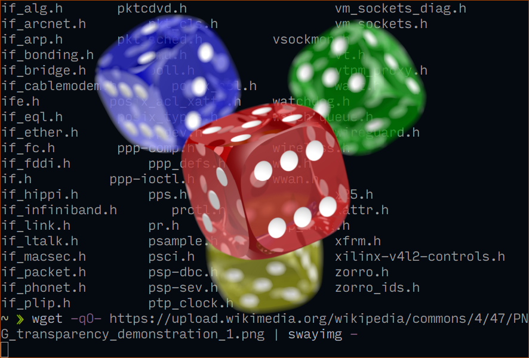

# Swayimg: image viewer for Wayland and DRM

Swayimg is a lightweight Wayland-native image viewer optimized for the Sway
and Hyprland window managers, featuring an overlay mode that simulates terminal
image display. The application supports slideshow and gallery modes, reads from
stdin and external commands, and is highly customizable via [Lua scripting](CONFIG.md).

- Support for the most popular image formats:
  - JPEG (via [libjpeg](http://libjpeg.sourceforge.net)),
  - JPEG XL (via [libjxl](https://github.com/libjxl/libjxl));
  - PNG (via [libpng](http://www.libpng.org));
  - GIF (via [giflib](http://giflib.sourceforge.net));
  - SVG (via [librsvg](https://gitlab.gnome.org/GNOME/librsvg));
  - WebP (via [libwebp](https://chromium.googlesource.com/webm/libwebp));
  - HEIF/HEIC (via [libheif](https://github.com/strukturag/libheif));
  - AV1F/AVIFS (via [libavif](https://github.com/AOMediaCodec/libavif));
  - TIFF (via [libtiff](https://libtiff.gitlab.io/libtiff));
  - Sixel (via [libsixel](https://github.com/saitoha/libsixel));
  - Raw: CRW/CR2, NEF, RAF, etc (via [libraw](https://www.libraw.org));
  - EXR (via [OpenEXR](https://openexr.com));
  - BMP (built-in);
  - PNM (built-in);
  - TGA (built-in);
  - QOI (built-in);
  - DICOM (built-in);
  - Farbfeld (built-in).
- Gallery and viewer modes with slideshow and animation support;
- Loading images from files and pipes;
- Preload images in a separate thread;
- Fully customizable keyboard bindings, colors, and many other parameters via
  [Lua bindings](CONFIG.md).




## Usage

`swayimg [OPTIONS]... [FILE]...`

Examples:
- View multiple files:
  ```
  swayimg photo.jpg logo.png
  ```
- View using pipes:
  ```
  wget -qO- https://www.kernel.org/theme/images/logos/tux.png | swayimg -
  ```
- Loading stdout from external commands:
  ```
  swayimg "exec://wget -qO- https://www.kernel.org/theme/images/logos/tux.png" \
          "exec://curl -so- https://www.kernel.org/theme/images/logos/tux.png"
  ```

See full [documentation](USAGE.md) for details.

## Configuration

The Swayimg configuration file is a Lua script. The full list of available
functions is described in the [documentation](CONFIG.md) and in the
[Lua source](extra/swayimg.lua) file.

[Example](extra/example.lua) of the configuration file is available after
installation in `/usr/share/swayimg/example.lua`.

## Install

[](https://repology.org/project/swayimg/versions)

List of supported distributives can be found on the
[Repology page](https://repology.org/project/swayimg/versions).

Arch users can install the program from the [extra](https://archlinux.org/packages/extra/x86_64/swayimg)
repository or from [AUR](https://aur.archlinux.org/packages/swayimg-git) package.

## Build

The project uses Meson build system:
```
meson setup my_build_dir
meson compile -C my_build_dir
meson install -C my_build_dir
```
